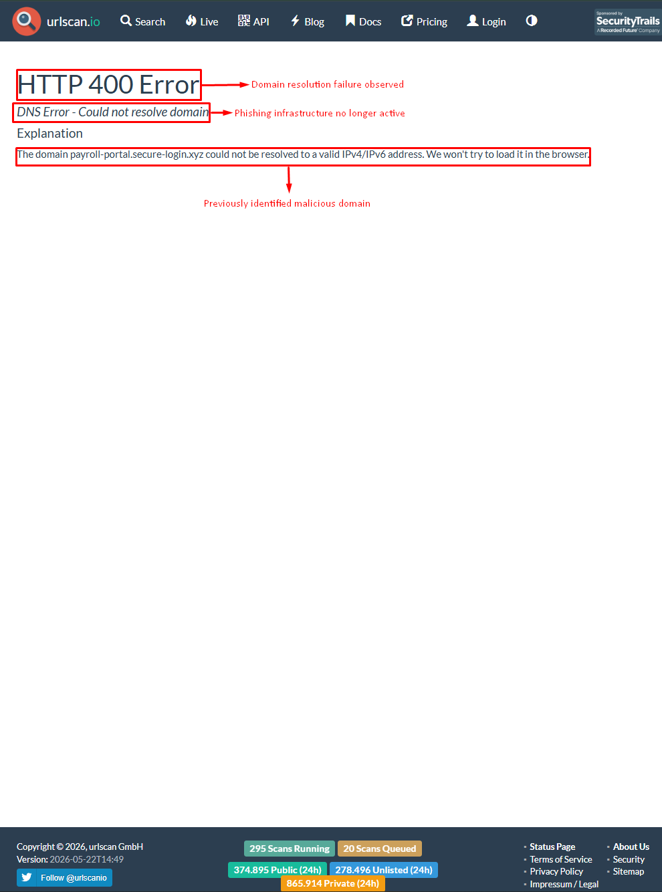

# 🚨 Case 02: Phishing URL Analysis

**Date:** 2026-05-24  
**Analyst:** Lucas Rodrigues  
**Severity:** MEDIUM  
**Environment:** Simulated SOC Lab  
**Tools:** URLScan.io, VirusTotal, Wireshark, Browser Developer Tools

---

# 🧾 Incident Summary

A suspicious phishing email was reported by multiple users after receiving a fake payroll update notification containing a malicious URL.

The phishing campaign attempted to impersonate a legitimate company portal in order to steal employee credentials through a fake login page.

Initial investigation identified suspicious domain patterns, external credential harvesting behavior and indicators commonly associated with phishing-based credential access attacks.

The activity was classified as a MEDIUM severity incident due to the risk of credential theft and unauthorized access.

---

# 🚨 Detection

## Reported Email

```text
From: hr-updates@noreply-payroll.xyz
Subject: Payroll System Update Required

Please update your employee information immediately:
http://payroll-portal.secure-login.xyz/update.php
```

---

# 🔍 Investigation & Analysis

## Suspicious Indicators

- Newly registered domain
- Suspicious `.xyz` TLD usage
- Fake payroll impersonation
- Credential harvesting page
- External redirection behavior
- Non-corporate login portal

---

# 🌐 URL Analysis

## Observed URL

```text
http://payroll-portal.secure-login.xyz/update.php
```

## Analysis Findings

- Fake Microsoft-style login page
- Suspicious domain reputation
- External credential collection
- Self-signed certificate behavior
- Credential submission redirected externally

---

# 🧠 MITRE ATT&CK Mapping

| Tactic | Technique | ID |
|--------|-----------|----|
| Initial Access | Phishing | T1566 |
| Initial Access | Spearphishing Link | T1566.002 |
| Credential Access | Input Capture | T1056 |

---

# 🧪 IOC Extraction

| IOC Type | Value |
|----------|-------|
| Phishing Domain | payroll-portal.secure-login.xyz |
| Malicious URL | http://payroll-portal.secure-login.xyz/update.php |
| Sender Email | hr-updates@noreply-payroll.xyz |
| Technique | Spearphishing Link |
| TLD | .xyz |

---

# 🔒 Containment Actions

- Blocked malicious domain at firewall/proxy
- Added domain to email security blacklist
- Alerted affected users
- Recommended password reset
- Monitored for suspicious authentication attempts

---

# 📚 Lessons Learned

- Users should verify suspicious links before access
- Email filtering policies should be strengthened
- Security awareness training remains essential
- Domain reputation monitoring should be improved

---

# 📸 Planned Evidence

- Phishing email screenshot
- Fake login page screenshot
- URLScan analysis
- VirusTotal domain reputation
- Browser network requests

---

# 🌐 Phishing Infrastructure Analysis

## Domain Reputation

Initial OSINT and threat intelligence analysis identified suspicious characteristics commonly associated with phishing infrastructure and credential harvesting operations.

### Indicators Observed

- Recently registered domain
- Suspicious `.xyz` top-level domain
- Fake payroll/login impersonation
- External credential collection behavior
- Low public reputation score
- No legitimate corporate presence

---

# 🧠 Threat Intelligence Correlation

| Source | Result |
|--------|--------|
| URLScan.io | Suspicious |
| VirusTotal | Malicious/Suspicious |
| WHOIS Analysis | Recently Registered |
| Browser Analysis | Fake Login Portal |

---

## URLScan Analysis

Threat intelligence investigation identified that the phishing domain was no longer actively resolving during analysis.

This behavior is commonly observed in phishing infrastructure that has been:

- Taken down
- Abandoned
- Blacklisted
- Disabled after detection

### Evidence



# 📌 Analyst Notes

The analyzed infrastructure demonstrated patterns frequently observed in phishing campaigns designed to harvest corporate credentials through impersonation and fake authentication portals
