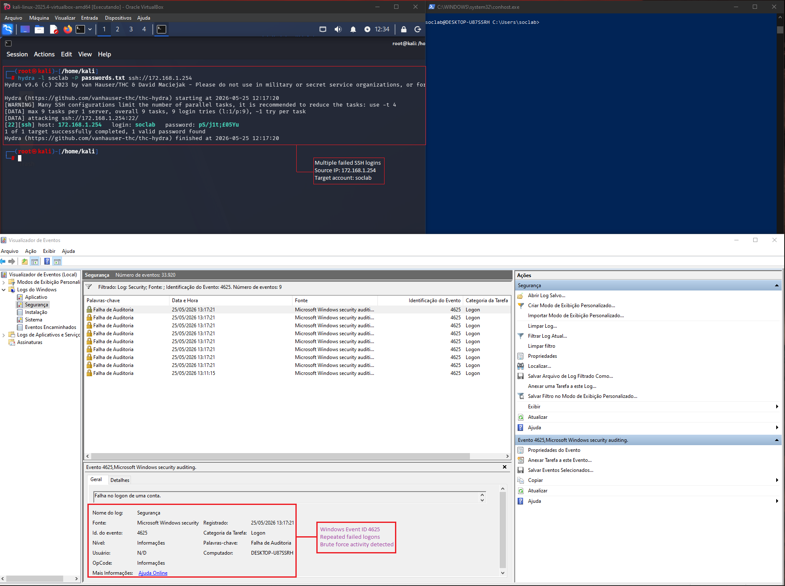

# 🚨 Case 03: Brute Force Detection & Authentication Analysis

**Date:** 2026-05-25  
**Analyst:** Lucas Rodrigues  
**Severity:** HIGH  
**Environment:** Windows Lab Environment  
**Tools:** Hydra, Windows Event Viewer, PowerShell, Wireshark, Sysmon, OpenSSH

---

# 🧾 Incident Summary

A brute force authentication attack was identified against a Windows host during a controlled lab simulation.

Multiple failed authentication attempts were detected targeting a local user account through repeated password guessing activity over SSH authentication services.

The attack simulation was performed using Hydra in a controlled environment to emulate common credential access techniques frequently observed in real-world intrusion attempts.

Initial investigation identified repeated failed logons, authentication anomalies, suspicious login patterns and Event ID 4625 failures associated with brute force behavior.

The incident was classified as HIGH severity due to the potential risk of credential compromise and unauthorized remote access.

---

# 🚨 Detection

## Initial Indicators

- Multiple failed SSH authentication attempts
- Repeated username targeting
- Rapid authentication failures
- Password guessing activity observed
- Windows Event ID 4625 spikes detected
- Repeated failed logons from same source IP

---

# 🔍 Investigation & Analysis

## Observed Behavior

- Consecutive failed logons detected
- Repeated SSH authentication attempts
- Authentication anomalies identified
- Password spraying/brute force patterns observed
- Failed logons recorded in Windows Security logs
- Event Viewer correlation confirmed attack activity

---

# 🌐 Attack Simulation

## Hydra Command

```bash
hydra -l soclab -P passwords.txt ssh://172.168.1.254
```

## Attack Findings

- SSH authentication service targeted
- Multiple password attempts observed
- Local Windows account targeted
- Successful password discovery achieved in lab environment
- Repeated failed authentication events generated

---

# 🧠 MITRE ATT&CK Mapping

| Tactic | Technique | ID |
|--------|-----------|----|
| Credential Access | Brute Force | T1110 |
| Credential Access | Password Guessing | T1110.001 |
| Initial Access | Valid Accounts | T1078 |

---

# 🧪 IOC Extraction

| IOC Type | Value |
|----------|-------|
| Attack Type | SSH Brute Force |
| Tool | Hydra |
| Event ID | 4625 |
| Authentication Service | OpenSSH |
| Source IP | 172.168.1.254 |
| Target Account | soclab |
| Technique | Password Guessing |
| Authentication Type | Failed Logon |

---

# 🖥️ Event Viewer Analysis

## Windows Security Logs

Windows Event Viewer analysis identified multiple Event ID 4625 entries associated with failed authentication attempts.

### Observed Indicators

- Repeated failed logons
- Authentication failure spikes
- Multiple login attempts in short period
- Brute force behavior pattern identified
- Failed SSH authentication attempts

### Evidence



---

# 🔒 Containment Actions

- Monitored suspicious authentication attempts
- Reviewed Windows Security logs
- Investigated targeted accounts
- Recommended account lockout policies
- Recommended MFA implementation
- Suggested SSH access restrictions
- Recommended strong password enforcement

---

# 📚 Lessons Learned

- Authentication monitoring is critical
- Event ID 4625 provides valuable detection visibility
- Strong password policies reduce brute force risk
- MFA significantly improves account security
- Account lockout policies help mitigate password attacks
- SSH exposure should be minimized when possible

---

# 📸 Evidence Collected

- Hydra brute force simulation
- Windows Event Viewer analysis
- Event ID 4625 failed logons
- SSH authentication evidence
- Authentication timeline
- IOC correlation screenshots

---

# 📌 Analyst Notes

The simulated attack demonstrated common brute force behavior patterns frequently observed during credential access attempts against exposed authentication services.

Log correlation between Hydra activity and Windows Security Event ID 4625 entries successfully confirmed the attack simulation and associated authentication failures.
