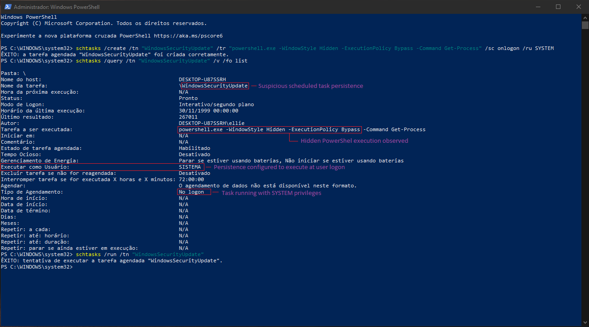
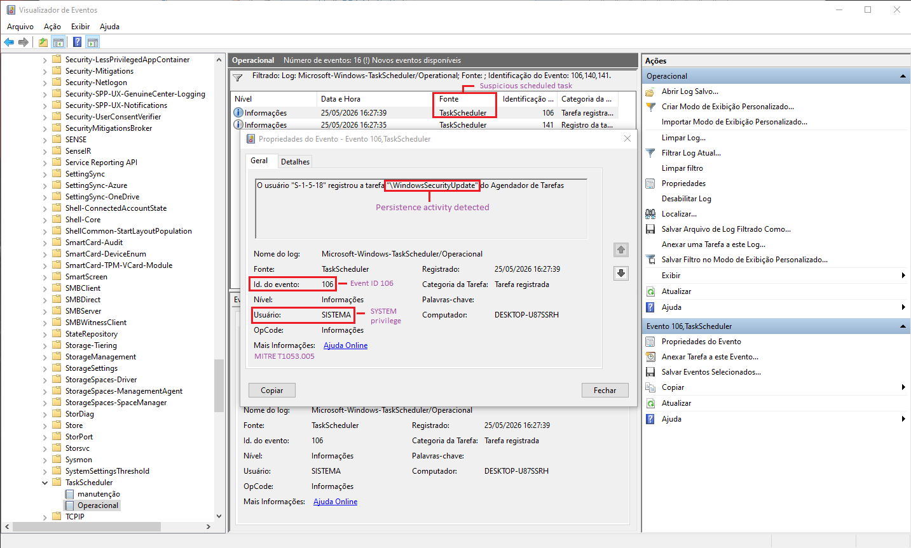

# 🚨 Case 04: Scheduled Task Persistence Detection

**Date:** 2026-05-25  
**Analyst:** Lucas Rodrigues  
**Severity:** HIGH  
**Environment:** Windows Lab Environment  
**Tools:** PowerShell, Windows Task Scheduler, Event Viewer, Sysmon

---

# 🧾 Incident Summary

A suspicious scheduled task persistence mechanism was identified during a controlled Windows lab simulation.

The task was configured to execute a hidden PowerShell command during user logon using SYSTEM privileges.

Analysis identified persistence behavior commonly associated with malware execution, privilege abuse and attacker persistence techniques.

Event logs confirmed task registration activity through Windows Task Scheduler Operational logs.

The incident was classified as HIGH severity due to the persistence capability and elevated execution privileges.

---

# 🚨 Detection

## Initial Indicators

- Suspicious scheduled task creation
- Hidden PowerShell execution
- SYSTEM privilege execution
- Persistence behavior detected
- Logon-triggered task activity

---

# 🔍 Investigation & Analysis

## Observed Behavior

- Scheduled task registered successfully
- PowerShell executed with hidden window
- Execution policy bypass observed
- Task configured for user logon persistence
- SYSTEM account used for execution

---

# 🌐 Persistence Creation

## Scheduled Task Command

```powershell
schtasks /create /tn "WindowsSecurityUpdate" /tr "powershell.exe -WindowStyle Hidden -ExecutionPolicy Bypass -Command Get-Process" /sc onlogon /ru SYSTEM
```

---

# 🧠 MITRE ATT&CK Mapping

| Tactic | Technique | ID |
|--------|-----------|----|
| Persistence | Scheduled Task/Job | T1053.005 |
| Execution | PowerShell | T1059.001 |

---

# 🧪 IOC Extraction

| IOC Type | Value |
|----------|-------|
| Task Name | WindowsSecurityUpdate |
| Event ID | 106 |
| Tool | schtasks |
| Execution | powershell.exe |
| Privilege | SYSTEM |
| Technique | Scheduled Task Persistence |

---

# 🖥️ Event Viewer Analysis

## Windows Task Scheduler Operational Logs

Windows Task Scheduler Operational logs identified Event ID 106 entries associated with suspicious task registration activity.

### Observed Indicators

- Scheduled task registered
- Persistence activity detected
- Hidden PowerShell execution
- SYSTEM privilege usage
- Logon persistence trigger identified

---

# 📸 Evidence Collected

## Scheduled Task Persistence



---

## Event ID 106 Detection



---

# 🔒 Containment Actions

- Reviewed scheduled task configurations
- Investigated persistence mechanisms
- Monitored PowerShell activity
- Recommended PowerShell logging
- Reviewed privileged task execution
- Investigated suspicious scheduled tasks

---

# 📚 Lessons Learned

- Scheduled tasks are common persistence vectors
- Hidden PowerShell execution is highly suspicious
- SYSTEM privilege abuse increases impact
- Task Scheduler logs provide valuable forensic evidence
- Persistence mechanisms should be continuously monitored

---

# 📌 Analyst Notes

The simulated persistence activity demonstrated how attackers may abuse Windows scheduled tasks to maintain access and execute PowerShell commands stealthily during user logon events.

Event ID 106 provided valuable detection visibility for identifying suspicious scheduled task registration activity associated with persistence techniques.
