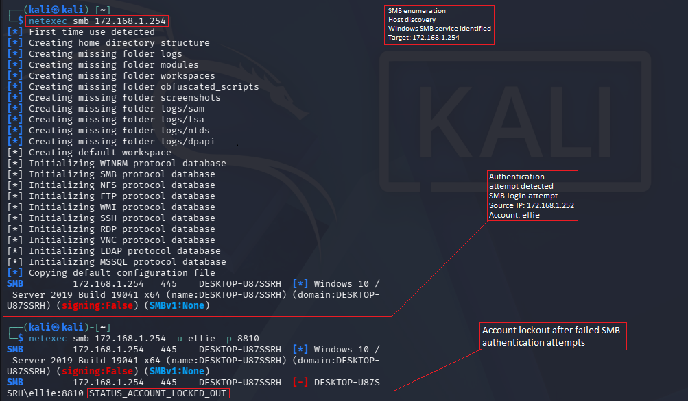
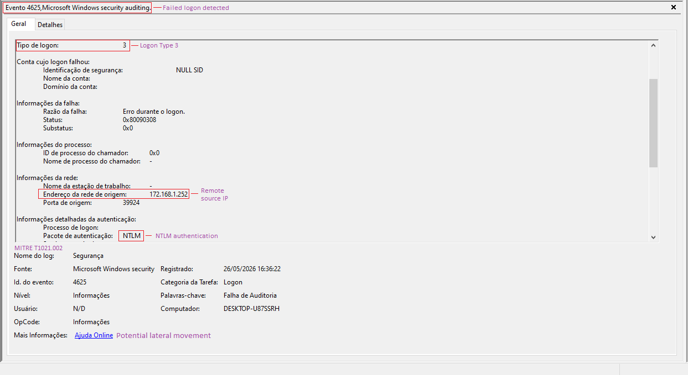
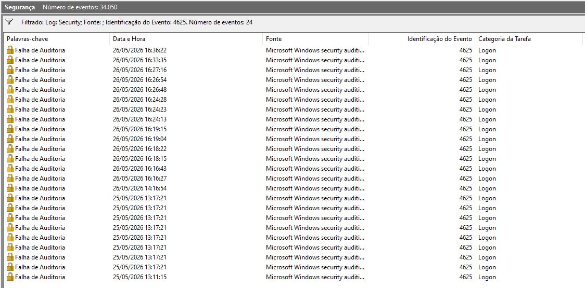

# 🚨 Case 05: SMB Failed Authentication & Event ID 4625 Detection

**Date:** 2026-05-26
**Analyst:** Lucas Rodrigues
**Severity:** MEDIUM
**Environment:** Windows Lab Environment
**Tools:** Kali Linux, NetExec, Windows Event Viewer, SMB, NTLM

---

# 🧾 Incident Summary

Multiple failed SMB authentication attempts were detected during a controlled Windows lab simulation using Kali Linux against a Windows target host.

The activity generated Windows Security Event ID 4625 entries associated with failed NTLM network logon attempts.

Repeated authentication failures resulted in temporary account lockout behavior, demonstrating Windows defensive mechanisms against unauthorized access attempts.

Analysis confirmed SMB enumeration activity, NTLM authentication attempts and failed remote logon behavior consistent with brute-force or lateral movement scenarios.

---

# 🚨 Detection

## Initial Indicators

* SMB enumeration detected
* Failed SMB authentication attempts
* NTLM authentication activity observed
* Event ID 4625 generated
* Remote Logon Type 3 activity identified
* Account lockout triggered after repeated failures

---

# 🔍 Investigation & Analysis

## Observed Behavior

* Windows SMB service identified remotely
* Multiple failed authentication attempts detected
* NTLM authentication package observed
* Remote source IP identified from Kali Linux host
* Repeated Event ID 4625 entries generated
* Account lockout protection activated

---

# 🌐 SMB Enumeration Activity

## Enumeration Command

```bash
netexec smb 172.168.1.254
```

---

## Authentication Attempt

```bash
netexec smb 172.168.1.254 -u ellie -p 8810
```

---

# 🧠 MITRE ATT&CK Mapping

| Tactic            | Technique                | ID        |
| ----------------- | ------------------------ | --------- |
| Lateral Movement  | SMB/Windows Admin Shares | T1021.002 |
| Credential Access | Brute Force              | T1110     |

---

# 🧪 IOC Extraction

| IOC Type       | Value           |
| -------------- | --------------- |
| Source IP      | 172.168.1.252   |
| Target Host    | DESKTOP-U87SSRH |
| Protocol       | SMB             |
| Authentication | NTLM            |
| Event ID       | 4625            |
| Logon Type     | 3               |
| Username       | ellie           |
| Detection Tool | NetExec         |

---

# 🖥️ Event Viewer Analysis

## Windows Security Logs

Windows Security logs identified multiple Event ID 4625 entries associated with failed SMB authentication attempts.

### Observed Indicators

* Failed NTLM authentication
* Remote network logon activity
* Source IP correlation
* Logon Type 3 identified
* Potential lateral movement behavior
* Authentication failure patterns detected

---

# 📸 Evidence Collected

## SMB Enumeration & Authentication Attempt



---

## Event ID 4625 Detection



---

## Security Log Overview



---

# 🔒 Containment Actions

* Reviewed failed authentication activity
* Investigated source IP behavior
* Validated account lockout protections
* Monitored NTLM authentication attempts
* Reviewed SMB exposure
* Investigated repeated authentication failures

---

# 📚 Lessons Learned

* SMB services are common lateral movement targets
* Event ID 4625 provides valuable detection visibility
* NTLM authentication failures should be continuously monitored
* Account lockout policies help reduce brute-force risk
* Windows Security logs provide strong forensic visibility for authentication events

---

# 📌 Analyst Notes

The simulated SMB authentication activity demonstrated how failed NTLM network logons generate Windows Security Event ID 4625 entries.

The lab validated detection visibility for failed SMB authentication attempts, remote network logons and account lockout behavior commonly associated with brute-force activity and lateral movement attempts in Windows environments.
